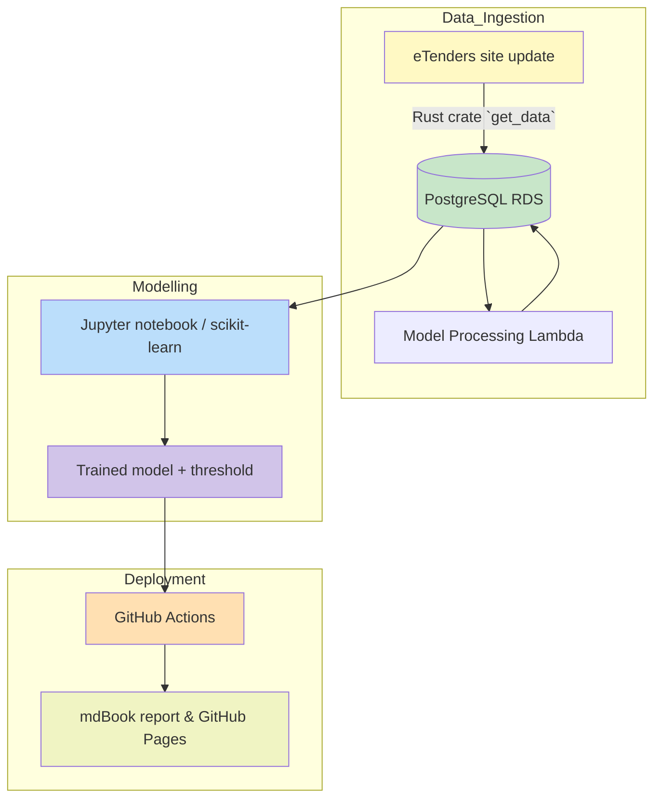

# Introduction & Executive Summary

## Overview
The Irish Government releases a huge range of tenders daily via email. These range from bin collection, general services, building managment all the way through anything a government may need to IT services/consulting contracts. Wading through this fire-host of information manually is time-consuming, inefficient and can lead to missing opportunities.

By training an ML model on the whole pipeline of possible tenders, with the aim of answering the question of "Which ones should we 'actually' bid on"?, we can find the tenders that should be responded to within the fire-hose of requests.

## How AI and ML integration impacts organisational change

As with any new technology introduction a huge factor associated with it's introduction is trust.

Primarily, can users rely on what they're being told? How can we assemble a body of evidence in the training of tools like this to prove to users the change will work in their favour?

Additionally, who is ultimately responsible for AI/ML's output and subsequent impact on the business? 

There are so many expamples already of IT in general being used as a smokescreen for dodging accountability, the Post Office scandal REF: being the most egregious recent example. Adding AI into this mix increases complexity as well as the temptation to simply offload governance entirely to a "black box". Consumers are already abdicating responsibility for major life decisions, REF: sometimes very much to their own detriment. Businesses may end up being no different if ethics aren't adhered to.

## Scope and Objectives
The report outlines the various approaches to this problem from an ML/AI point of view, including possible training methods and models,

## Projected Benefits 
Having ML and AI provide a 'first look' screening of tenders will deliver the following: -

* Remove time spent on intial screening
* Allow Sales teams to only focus on relevant bids
* Less noise, more signal reduces the chances of missing tenders 

We can also hand AI the job of creating a quickly scannable summary of tenders that the ML pipeline deems suitable. Something LLM's are very adept at. 

// TODO: follow on paragraph somewhere about what the Irish Govt have said to Paul about making the tender data more accessible/easier to parse and so on. Possibly use MCP for this!!

# Machine Learning and AI principals

## ML and AI in this use-case
Firstly we need to spend a bit of time differentiating between ML and AI since recently they've been blended very much into one big bucket. At the very least ML has been run over by AI in the public consciousness.

Machine learning preceeded AI by using past data, algorithms and pattern identification to predict some sort of future state based on data it's not seen before. Usually within a specific realm or narrow topic.

AI as offered by ChatGPT, Anthropic Claude etc. relies on exposure to huge amounts of data with the goal of developing a more general response to a much wider range of questions across different subjects. 

While we can look at a vast array of ML approaches since we're looking to make a decision ("bid on this or not?") it seems immediately obvious to start our investigation using a decision tree. However, there's a fundamental issue with that assumption because our main piece of data on which to answer this bid/no-bid question is the tender title, which is all text. 

We can use ML to answer the specific question about whether to bid and then have AI provide an actionable summary of the text, something it's much more equipped to do. 

* ML component - ask a question of a specific data set
  * Gather the data
  * Make the data palatable - pre-processing
  * Create a custom ML algorithm based on past data - model training
  * Tune with any hyper-parameters
    * Driven by business requirements
  * Supply a set of tender records that the ML model deems should be responded to
* AI component - summarise this text
  * Send the information to an AI endpoint and have it return a summary based on a prompt

The key differentiation here is we're using ML to answer a specific question about a fairly simple data-set. With AI we're asking it to perform a general task for us in quite a hands-off way.

Arguable, given recent advancements, you could just remove the ML stage and throw everything at AI but this would prove more costly. Using ML to reduce the pool of tenders (using straightforward open-source tools) gives you better control over spending and allows you to tweak what's deemed acceptable to hand over to the AI summary step. 

## Integration into existing digital solution lifecycle

One of the key aspects of software development that especially applies to ML is quick iterations to see what may or may not give a useful result. 

Thankfully existing libraries allow fast iteration and just trying things out to see which approach might fit best. 

No-one wants to spend 6 months working on something that ultimately won't supply a result. 

Breaking the delivery down into two week sprints, setting stage goals, reviewing the work on a regular basis with the stakeholders are all part of modern software delivery that fits very well into this sort of ML integration/delivery project.

## Standards and Compliance

Version 1 (V1) is already signed up to access the eTenders data and respond so there is no part of the proposed usage that prohibits it's use, other than onward transmission to third parties. 

That said, for this to be more than a proof of concept/demo it would be appropriate to obtain permission from the Office of Government Procurement (OGP) to do anything further. At this stage everything is being used for learning and study, not commercial application.

However, with this in mind, it's already been proposed internally within V1 to respond to the OGP's question about how AI/ML might help them manage the tender process, increase transparency and modernise how they publish tenders by sharing this project/proof of concept with them.

Outside of this context training ML models should pay attention to local laws & statutes (i.e. GDPR), ensure the data is used in an ethical way and aim for transparency when it comes to any decisions that are under-pinned by any sort of AI or ML training process.

# Tender Data Overview

As stated in the Overview section we're looking to reduce the need for sales team members to scrutinize every tender opportunity published by Irish Government. Ideally an ML model processes each tender record and decides whether it's worth further scrutiny. 

At first glance the tender information looks pretty straightforward. Each record consists of the following:-

**tender records** table
| Column name | Initial Type | Description                                    | Modified Type          | 
|-------------|--------------|------------------------------------------------|------------------------|
| id          | integer      | row index in the database as records are added | -                      |
| title       | text         | title/subject of the tender                    | text                   |
| resource_id | text         | unique internal record number for the tender   | integer                |            
| ca          | text         | name of the contracting authority              | text                   |
| published   | text         | date tender was published                      | timestamp w/o timezone |
| deadline    | text         | deadline date for submission by contractor     | timestamp w/o timezone |
| procedure   | text         | what's the process of submitting a bid         | text                   |
| status      | text         | is the tender still open/closed and so on      | text                   |
| pdf_url     | text         | url for downloading the whole tender           | text                   |
| awarddate   | text         | when the tender was awarded                    | date                   |
| value       | text         | what is the tender worth?                      | numeric                |
| bid         | integer      | ML label: 1=bid, 0=no bid, NULL=unlabelled     | integer                |

**pdf content** table
| Column name          | Type                    | Description                                            | 
|----------------------|-------------------------|--------------------------------------------------------|
| resource_id          | text                    | unique internal record number of the tender            |
| pdf_text             | text                    | content of the tender pdf                              |
| extraction_timestamp | timestamp with timezone | when was the pdf read into the db?                     |
| processing status    | text                    | has the pdf been processed properly?                   |
| detected codes       | text array              | what codes have been identified in the tender?         |
| codes_count          | integer                 | how many codes were found?                             |

All this has been pulled into PostgreSQL database for easy manipulation. New tenders are pulled into the database on a daily basis as they're published, which includes parsing (reading and storing) pdf text as well since this contains some very useful additional context. 

The challenge with the data however is that 'most' if it appears in the original database as text, which is especially problematic when running queries. Since it's being dumped into a database we need to make some changes before we even think about it's "shape"...

1. Retroactively modify the db columns to change use better types for the columns
2. Change the Rust parsing code to match the types the db is now using

Then we can at least begin to consider which columns might help us answer the question -> "Should we respond to this tender?"

## Manually adding the 'bid' column

In order to be able to train a model on this data we've had to manually label 2000+ records with bid (1) or no bid (0), taking a supervised learning approach.

Since we're going to primarily rely on the title data for this we created a helper script to display that and have the user select y/n to update the table with the appropriate value. Labelling 200o+ records took around 2 hours.

## Data Manipulation/Cleanup - tender_records

Dates are not relevant for this ML model, we simply want to decide whether we should submit a bid or not. This means we can remove the `published`, `deadline` and `awarddate` columns entirely.

### id
This can be removed since `resource_id` is unique, we don't need another id. 

### resource_id
This is just a record signifier. We don't actually need to pay attention to it at all when training our model so we can drop this also.

### title
This is the key field we're looking at training the model on to predict whether we should bid (bid column = 1) or not (bid column = 0)

One thing in our favour is that EVERY record has a title field so we don't have to deal with null data in this case.

### ca
This mighe be relevant if we can figure out how to encode this for training.

### procedure
This might be relevant if we can figure out how to encode this for training to make it useful.

### status
Not relevant for training so can be removed from the training data. 

### pdf_url
Not relevant for training so can be removed from the training data. We could _maybe_ turn this into a data point but as it is 25% of tenders don't have a PDF attached to them. It was added initially out of curiosity but ended up being removed as it had no impact.

### pdf_content

This second table is interesting because were a tender has a pdf_url link we can extract the PDF text and get a lot more context.

However, only 75% of tender_records have a PDF attached to them. This makes it problematic because from further investigation of approximately 140 'bid' records, 10% of these don't have a PDF attachment at all.

### value

Again nearly 50% of records don't have a value and making any assumptions about these (filling in values, adding a mean) would likely only introduce innacuracies. Conversely there might be multi-million pound values hidded in the PDF content. So with this in mind we can't rely on value as a feature of the tender data for ML training. 

We can though use this content in the 'non-ML' component of the solution though, where the pdf content exists.

## Model Selection

Supervised learning seems most appropriate as we're because by labelling the data we can teach the model what is important and have it apply that to recognising the difference between tenders to bid on and not to bid on. 

Since we're asking a simple question ("Is this tender suitable to make a bid on or not?") that isn't something we can assume will work with un-supervised learning because there's no inherent pattern to learn/discover. We're primarily going to rely on one feature (title in tender_records) which isn't sufficient for an un-supervised approach to work. 

Similarly, semi-supervised learning isn't appropriate yet because we only have labelled records. In six, twelve or twenty-four months it might be well worth taking the baseline supervised model and re-running the training. See the section [New Features and Continuous Improvements](#new-features-and-continuous-improvements) later in this proposal.

Q: How do we conclude why Supervised is better/most suitable.

# Exploratory data analysis graphics

# Evaluation metrics

# Workflow

# Testing and Debugging

From the original (labelled) data of approx 2000 records we've carried out an 80/20 split or training and testing. Since there are new tenders being released daily we can perform the validation stage on this new, un-labelled data and perform a manual screen of the results to see how effective they are. 

# Deployment

We're employing a number of 'best in class' technologies to get the results we need. 

AWS serverless Lambda functions
 * The cheapest compute available on the cloud REF: ?
 * Written in Rust, the fastest language for Lambda runtimes REF: 

# Risk and Mitigation for AI

Since the data is made up of commercial requests for suppliers to respond to a governmental body or organisation it doesn't contain Personal Identifiable Information (PIR) so isn't subject to GDPR. Ethics in AI usually gains teeth around PIR, potential for harm or abuse 

# Recommendations and Conclusions (Rubrik)

# Business Impacts

# New Features and Continuous Improvements
