# Implementation and Data Product Design

## Data Ingestion, Investigation and Prep

Each record consists of the following:-

**tender records** table
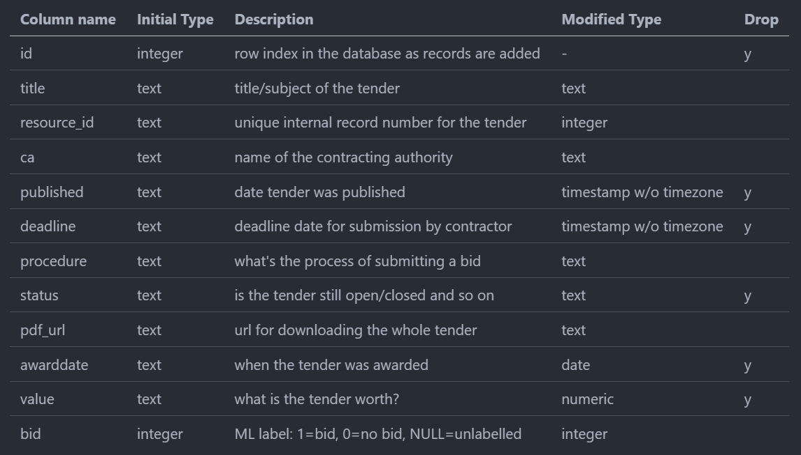

All this has been pulled into PostgreSQL database for easy manipulation. We'll 'drop' all the date columns as they're irrelevant to our question.

Then we can go through each column and decide whether it needs further attention.

### Labelling the 'bid' column for Supervised learning

To train a supervised learning model on this data we've had to manually label 2000+ records with bid (1) or no bid (0), which took around 2 hours.

### Data Manipulation/Cleanup

#### id
This can be removed since `resource_id` is unique, we don't need another id. 

### title
This is the key field we're looking at training the model on to predict whether we should bid (1) or not (0). Happily EVERY record has a title field so we don't have to deal with null data in this case. 

### contracting authority (ca)
CA has a finite number of possibilities so we're going to one-hot encode this.

### procedure
Procedure has a finite number of possibilities so we're going to one-hot encode this.

### pdf_url
Not relevant so can be removed from the training data. We could _maybe_ turn this into a data point but this is problematic as 25% of tenders don't have a PDF attached to them.

### value
Again nearly 50% of records don't have a value and making any assumptions about these (filling in values, adding a mean) would likely only introduce innacuracies. Conversely there might be multi-million pound values hidded in the PDF content. So with this in mind we can't rely on value as a feature of the tender data for ML training. 

## Decision Tree
Remember from [Model Selection and Methodologies](./3_developing_ai_and_ml_apps.html#model-selection-and-methodologies) that we don't believe Decision Trees will actually work well. Can we show this? 

Refer to [decision_tree_model.ipynb](https://github.com/robertsweetman/module_2/blob/main/python/decision_tree_model.ipynb) preview view for the code. 

Here's what we get initially...

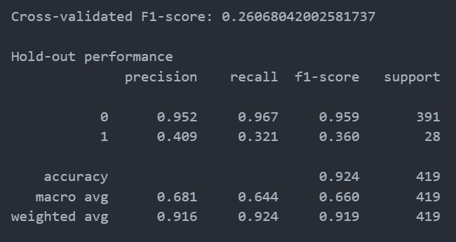

This approach really falls down when looking for bids. We're only hitting 41% of real bids (precision) and recall is also really low. So we can say the model is excellent at recognising 'no-bids' but it's missing two-thirds of real bids and miss-labelling many non-bids as bids (low f1-score).

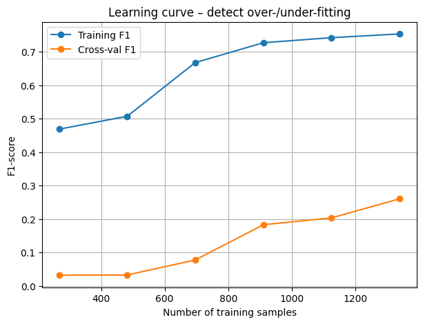

We can also show visually how this type of approach over-fits quite badly by plotting the learning curve. The model performs much better on data it's seen before (blue) than new data (orange). The curves don't converge and they should if the fit was good. 

Most importantly, even when you add more training data the gap doesn't close which indicates the model has learnt patterns based on that only, rather than a general pattern.

## Linear Regression Investigation

Refer to [etenders.ipynb](https://github.com/robertsweetman/module_2/blob/main/python/etenders.ipynb) preview for the code.

After we've pulled in the data to create a dataframe using a helper script it's worth taking some time to look at the data including words that push the model to 'bid' or 'no-bid'

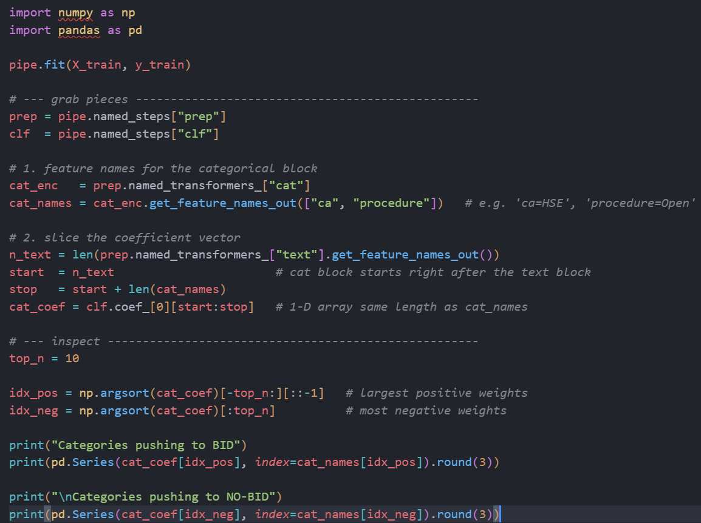

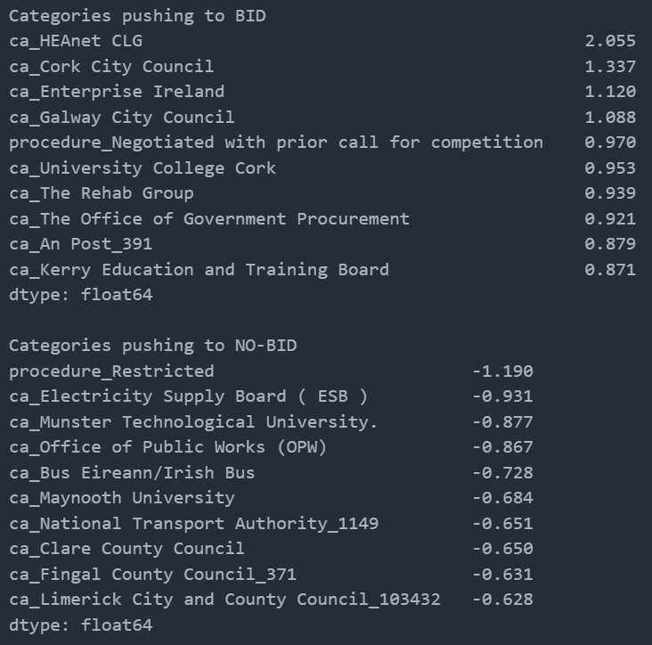

We're looking at text, categorical values and numeric fields. It might also be interesting to see if the numeric field ('has-pdf') is adding any value here at all.

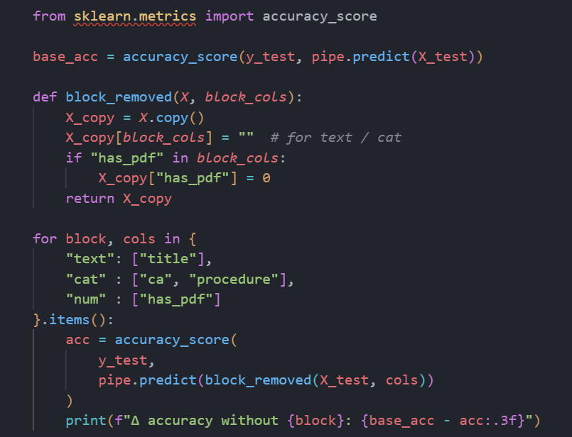

* accuracy without text: -0.017
* accuracy without cat: -0.031
* accuracy without num: -0.007

Looks like we can basically remove the 'has_pdf' column from the data.

We can also look at what individual categories most impact or detract from a tender being market as a bid.

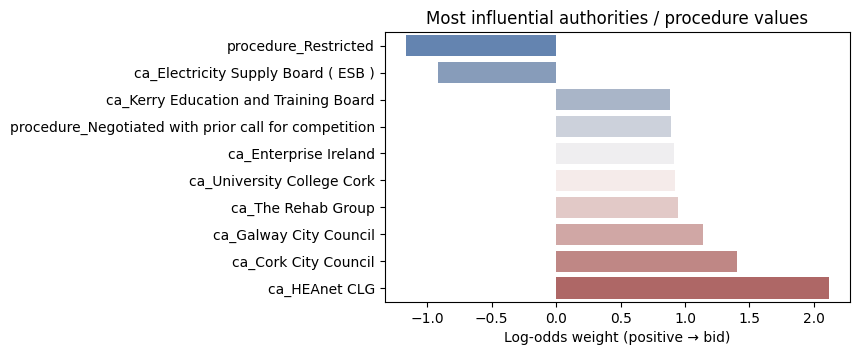

However, once we start looking at the outcomes (via a confusion matrix) we begin running into the issue with the title data as the starting point and our goal of reducing false positives and the overall 'filtering' workload.

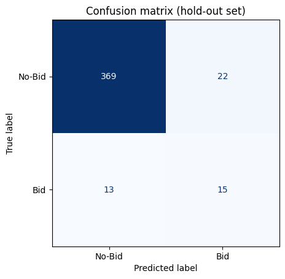

With a default threshold of 50% we're getting 13 Bids labelled as No-Bid i.e. a pretty high false-negative rate. Since a false negative might be worth a few million Euros this doesn't justify saving someone time doing the filtering because at this point that saving doesn't equate to the missed opportunities value...

## Do tokenizer choices have a big impact?
As an exercise I decided to look at whether tokenizer choices made an impact on this problem.

Refer to [baseline_text_models.ipynb](https://github.com/robertsweetman/module_2/blob/main/python/baseline_text_models.ipynb) for the code.

Just off the bat we can rule out TF-IDF + LogReg and Hashing + Log reg on the basis of the huge number of false positives which would waste our sales people's time.

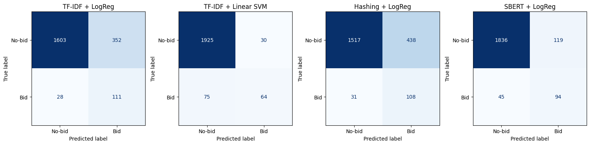

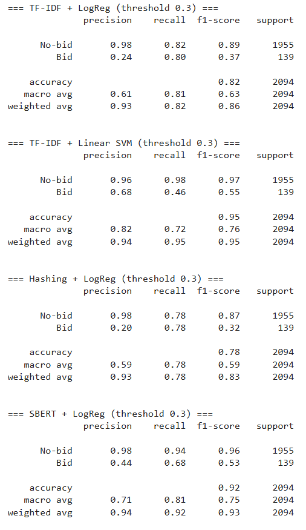

TFIDF + Linear SVM looks like the best overall candidate as while the false negative rate on the confusion matrix is higher than with SBERT + LogReg the false positive (time-wasting) number starts far lower. TFIDF + Linear SVM also has a higher `Bid Precision` F1 score.

## Final TFIDF + Linear SVM model

Refer to [tfidf_linearSVM.ipynb](https://github.com/robertsweetman/module_2/blob/main/python/tfidf_linearSVM.ipynb) for the code.

Let's take everything we've learned about our problem space and put it into play.

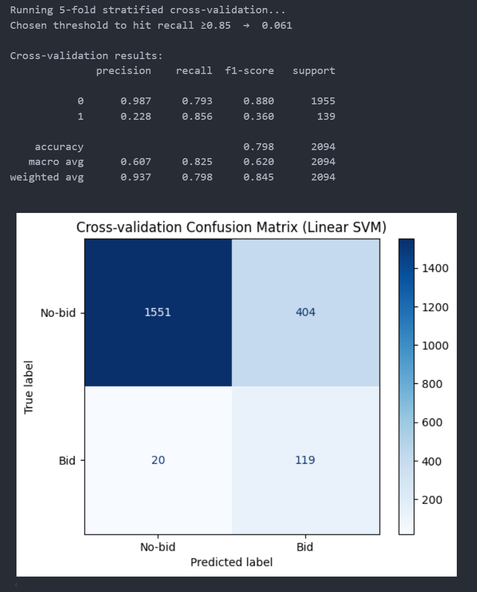

What we see is that we're now hitting few false negatives and have a high recall but to get this we've had to set our probability threshold very low indeed, meaning workers are still having to review 25% of bids, given the high false positive rate.

We can attempt to add a cost weighting to false negatives but at this threshold level that has zero impact. Changing the threshold directly impacts the decision boundary so we can impact false negatives that way BUT we've now got to a point where it's clear that the model needs more data. 

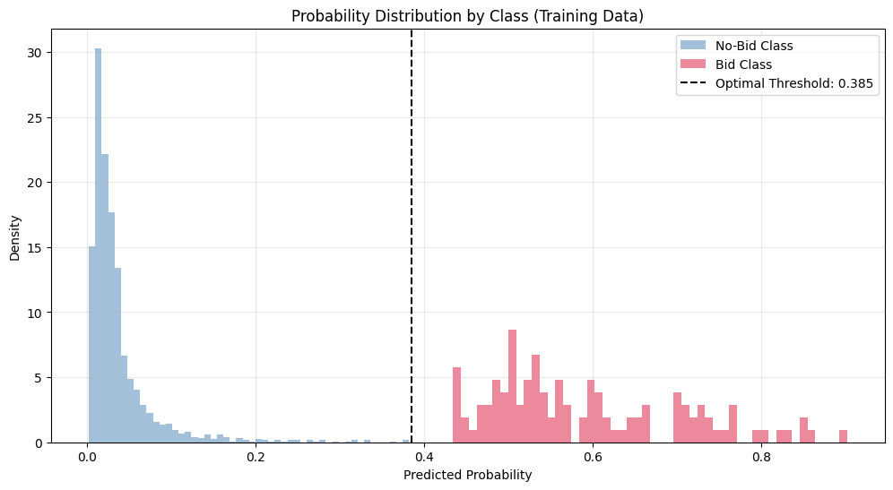

Around the 0.385 threshold there's nothing we can do to influence the model further. 

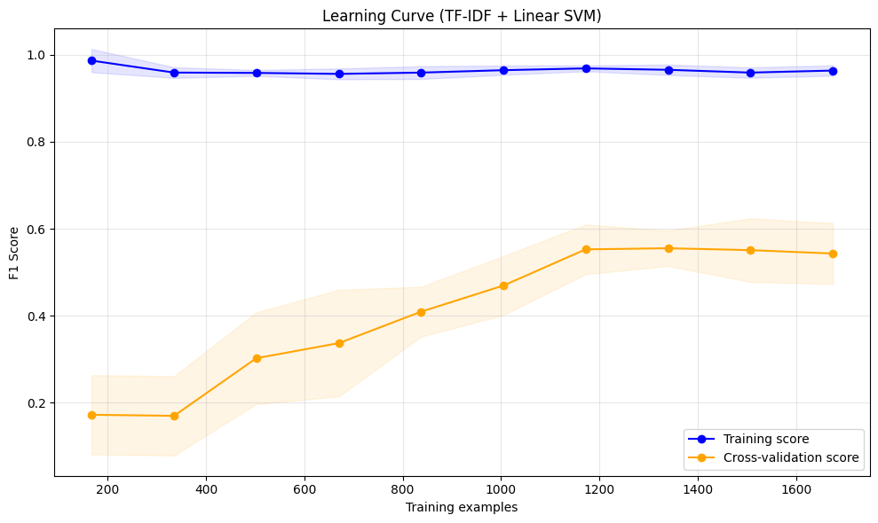

Since the scores are still a way away and haven't converged this also suggests we could do with more data... However, on the positive side it's not over or under-fitting like the Decistion Tree.

More on how to improve things in the [Recommendations and Conclusions](./6_recommendations_and_conclusions.md) section.

## Ethical Considerations

Training ML models should pay attention to local laws & statutes (i.e. GDPR), ensure the data is used in an ethical way and aim for transparency when it comes to any decisions that are underpinned by any sort of AI or ML training process.

Version 1 also has a AI Governance framework (Transforming AI Governance, 2025) that goes through a number of discovery steps to ensure directives around AI are adhered to, maintain compliance and ensure any ethical and social implications are made clear to all parties involved.

## Regulatory Compliance

Version 1 (V1) is already signed up to access the eTenders data and respond so there is no part of the proposed usage that prohibits it's use, other than onward transmission to third parties. 

That said, for this to be more than a proof of concept/demo it would be appropriate to obtain permission from the Office of Government Procurement (OGP) to do anything further. At this stage everything is being used for learning and study, not commercial application.

However, with this in mind, it's already been proposed internally within V1 to respond to the OGP's question about how AI/ML might help them manage the tender process, increase transparency and modernise how they publish tenders by sharing this project/proof of concept with them. 