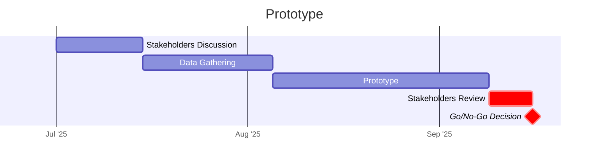
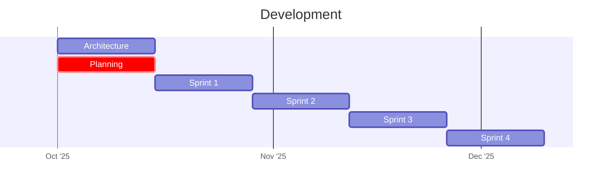
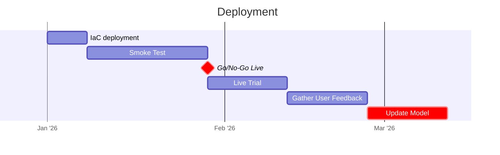

# Team Collaboration and Communication plan

## Collaboration
Modern software development now sits on top of a whole tool chain to surface work, encourage transparency and foster communication. In this type of project we'd keep all the code in source control (Git), all the tasks in Jira and run a daily agile-type stand-up to share progress or air any blockers. 

There's usually a chat app like Slack or Teams for quick threads to tackle particular issues or problems.

Outside the feature development being carried out by developers there would be a Team Lead, nominally set with tasking individuals with work as well as acting as an arbiter on technical direction. Possibly there would be a Software Architect fulfilling this role but if it's a smaller project this might be un-necessary. 

The Team Lead would also likely inteface to the Project Manager who would have overall responsibility for reporting outwards as to the state of the development, especially in relation to time to completion. Their role involves understanding the true state of the project and communicating this to stake-holders. Expectation management is key here, especially if something un-expected comes up and there _might_ be a possible delay. 

You could easily use dashboards to broadcast the current project state, identify key milestones and plot progress along a gantt chart (see below)

There are stage gates following prototype delivery and after the model has been deployed (smoke test) for a number of weeks. This first gate gives stakeholders the opportunity to see how the application would work in theory. The second gate is for developers to check that the solution actually works in practice before 'go-live'. 

Then, once it's been running for two to four weeks updates can be made based on live data and user feedback. Maybe there's some part of the performance that needs tweaking?

## Sharing Best Practices
From my experience within Version 1 the primary way that best practices are shared is via 'lunch and learn' sessions. It's always challenging to pull people's attention from client work so recorded sessions make the information more accessible. 

Keeping these up-to-date might mean creating your own internal news letter, blog or wiki that updates the same topic when new or better ways of doing things come to light. Making this content public also massivley boosts the organisations visibility and credibility in the wider world.

