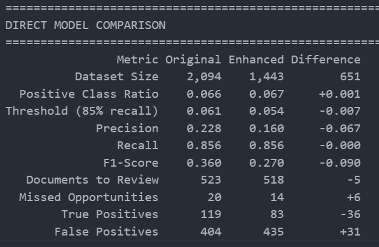

# Recommendations and Conclusions

## Model Summary

We made a good start trying to pick bid opportunites from the tender title only but this resulted in too many false negatives. 

We should manually review 25% of the tenders that don't have PDFs and add more context to the training process for the others by including the following additional data: 

* Tender codes from the PDF - via One Hot Encoding
  * We know, as a business, which tender codes we're interested in so there's a selection machanism here. (see appendix)
* A count of the number of codes we find in a PDF
* Additional amount of text from the PDF's
  * The "Lot 5.x.x" section of the PDF contains more details about the requirements

Then it's pretty simple to run a comparison.

We've reduced the false negative rate quite substantially. Yes, this means manually reviewing more bids but we've still cut that by 50% and are in a good place when it comes to false negatives.

## Conclusion

Recommend deploying this and re-running the training monthly to update it as new tenders are published.

## Further Improvements and Ongoing Evaluation

At some point an additional step would be to cross reference the bid/tenders database with "actual bids won" as well. This could add another layer to the entire exercise whereby it might also be possible to further increase the accuracy of our tender submission scanning and (with enough wins) possibly predict, based on past successes, whether a new tender is likely something we might win also.